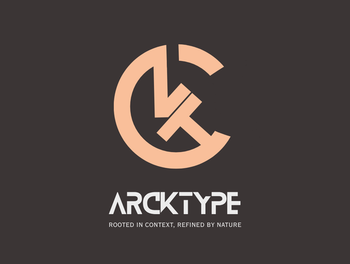
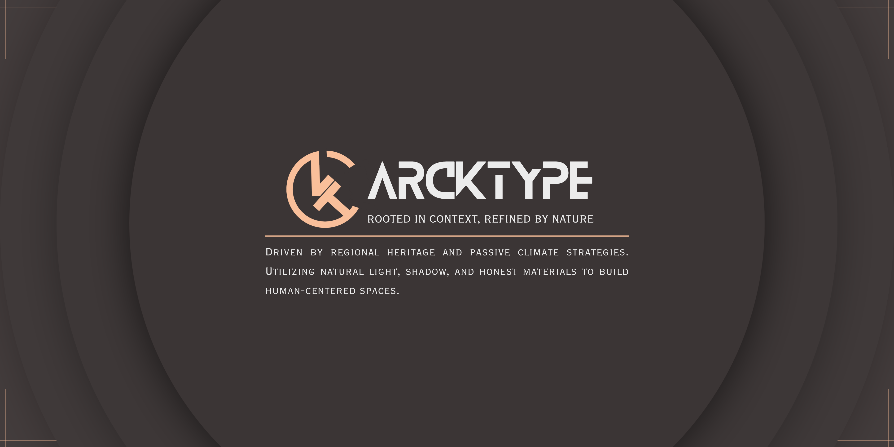

# IT-Skills-Portfolio
This repository contains a brief information about me and also includes includes my brand assets and Activity 1.
# About Me
Good day! I am Kateleen C. Cabamungan, a student of architecture that gets quite immersed in its history and design process.

One architecture that struck me the most is the regional heritage and atmospheric mastery of the He Art Museum. The museum became a massive inspiration shaping my design philosophy. 

I approach design through deep socio-cultural research and passive climate strategies. I believe in using natural light, environmental shading, and honest materials such as exposed concrete and wood, to create harmonious, human-centered spaces.

To find out more about me, more details can be seen in Activity 1.
# Brand Assets
<table>
  <tr>
    <td width="57%" align="center" valign="middle">
      
    </td>
    <td width="45%" align="center" valign="middle">
      
    </td>
  </tr>
  <tr>
    <td colspan="2" align="center">
      
    </td>
  </tr>
</table>
